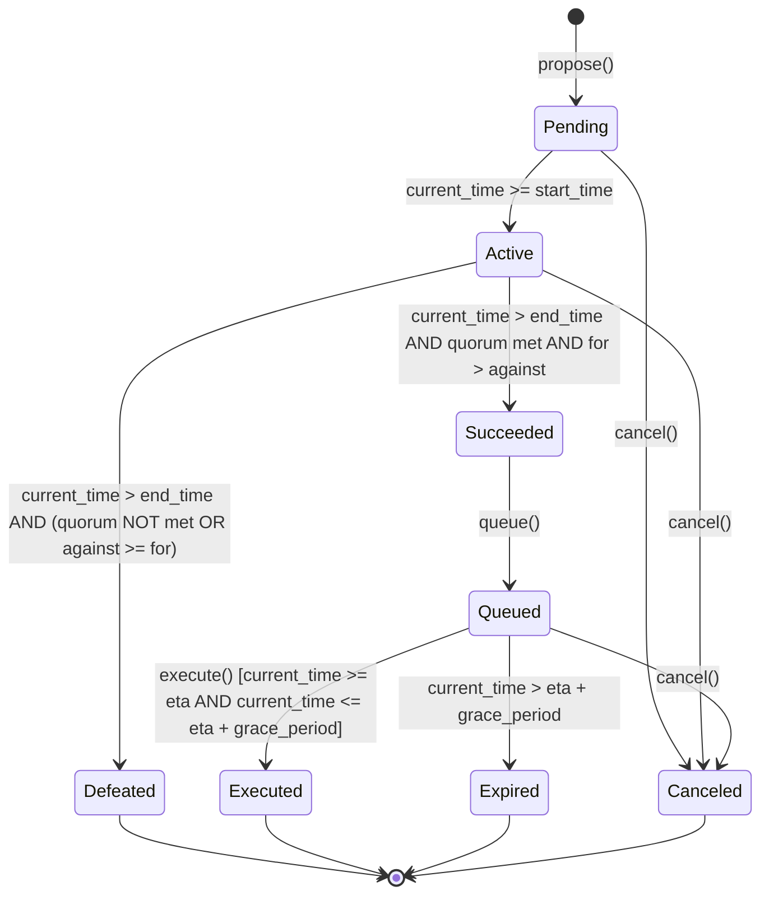

# Canonical Governance ABI Specification & State Machine

## 1. Overview
This specification defines the canonical Application Binary Interface (ABI), lifecycle state machine, quorum calculations, and write-gating drift protection mechanisms for OrbitPay's Soroban governance contracts.

Prior to enabling any user-facing contract write operations (`create_proposal`, `cast_vote`, `execute_proposal`), the frontend enforces schema verification and canonical state evaluation against this specification.

---

## 2. Soroban Method Signatures & Types

### Methods
| Function Name | Parameters | Return Type | Description |
| :--- | :--- | :--- | :--- |
| `propose` | `proposer: Address`, `title: String`, `description: String`, `actions: Vec<ProposalAction>` | `u32` | Creates a new governance proposal. Returns the unique `proposal_id`. |
| `vote` | `voter: Address`, `proposal_id: u32`, `support: u32` (0=Against, 1=For, 2=Abstain) | `void` | Casts a weighted ballot based on the voter's token balance snapshot. |
| `queue` | `proposal_id: u32` | `void` | Transitions a succeeded proposal into the timelock execution queue. |
| `execute` | `proposal_id: u32` | `void` | Executes all queued actions in order once the timelock delay has elapsed. |
| `cancel` | `caller: Address`, `proposal_id: u32` | `void` | Cancels a pending or active proposal (callable by proposer or admin). |
| `get_proposal` | `proposal_id: u32` | `Proposal` | Fetches complete proposal record including vote tallies, timestamps, and status. |
| `get_state` | `proposal_id: u32` | `u32` | Computes live state on-chain based on current ledger timestamp. |

### Data Structures
```rust
pub struct ProposalAction {
    pub target: Address,
    pub function_name: Symbol,
    pub args: Vec<Val>,
}

pub struct Proposal {
    pub id: u32,
    pub proposer: Address,
    pub title: String,
    pub description: String,
    pub actions: Vec<ProposalAction>,
    pub for_votes: i128,
    pub against_votes: i128,
    pub abstain_votes: i128,
    pub start_time: u64,
    pub end_time: u64,
    pub eta: u64,
    pub executed: bool,
    pub canceled: bool,
}
```

---

## 3. Proposal Lifecycle State Machine

A proposal transitions through deterministic states governed strictly by voting period timestamps, vote tallies, quorum thresholds, and timelock boundaries.



### Canonical States (`CanonicalProposalStatus`)
1. **Pending (`0`)**: Proposal created, awaiting start time block / voting commencement.
2. **Active (`1`)**: Open for token holder voting.
3. **Canceled (`2`)**: Cancelled by original proposer or guardian multisig.
4. **Defeated (`3`)**: Voting period concluded, failed quorum (`for + against + abstain < quorum`) or `for_votes <= against_votes`.
5. **Succeeded (`4`)**: Voting concluded, quorum achieved (`for + against + abstain >= quorum`) and majority attained (`for_votes > against_votes`).
6. **Queued (`5`)**: Timelock initiated with scheduled execution time `eta = queue_time + timelock_delay`.
7. **Expired (`6`)**: Timelock grace period elapsed without execution (`current_time > eta + grace_period`).
8. **Executed (`7`)**: Actions successfully dispatched and applied on-chain.

---

## 4. Quorum & Majority Calculation

- **Minimum Quorum**: 20% of total circulating voting token supply at snapshot.
  $$\text{Quorum Met} \iff (\text{for\_votes} + \text{against\_votes} + \text{abstain\_votes}) \ge \text{quorum\_threshold}$$
- **Majority Rule**: Simple majority among decisive ballots.
  $$\text{Majority Met} \iff \text{for\_votes} > \text{against\_votes}$$
- **Timelock Delay**: Default 48 hours (172,800 seconds).
- **Execution Grace Period**: Default 14 days (1,209,600 seconds) after ETA.

---

## 5. Front-End Write Gating & ABI Drift Guard

To avoid state corruption or lost transactions from unverified contract upgrades:
1. **`assertGovernanceCompatibility(contractId, requiredAbiVersion)`**:
   Validates deployed Soroban contract bytecode spec and interface against canonical version `v1.0.0`.
2. **Write Gating**:
   Frontend mutation functions (`createProposal`, `vote`, `executeProposal` in `src/lib/soroban/governance.ts`) invoke `assertGovernanceCompatibility`. If compatibility is unverified or gated:
   - Throws `GovernanceAbiError("Governance contract writes are currently gated pending canonical ABI deployment verification.")`.
   - Governance UI renders an informational warning banner and disables submission actions.
